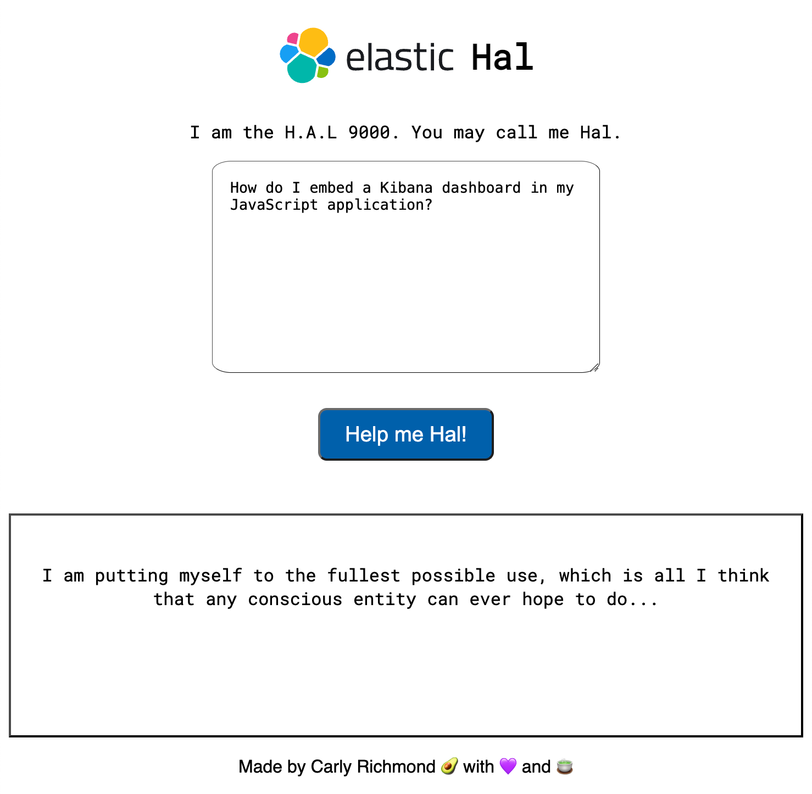

# Elasticsearch OpenAI Chatbot

## Overview

This project contains Elastic Hal, an example ChatBot leveraging Elasticsearch and the OpenAI ChatCompletion API. This sample forms the basis of [Daily Elastic Bytes S5 E15](https://youtube-todo).



## Architecture

As shown in the below diagram, this is a simple 3-tier web application:


It comprises of: 

1. A simple framework independent HTML, JavaScript and CSS UI (`index.html|js|css`). 
2. Node.js Express server (`server/server.js`) with utilities for communication between Elasticsearch and the Chat Completion API from OpenAI.
3. Elasticsearch data store, containing answers and solutions from [http://discuss.elastic.co](http://discuss.elastic.co).

## How to run

### Prerequisites

Initiating the connection between the Express server and Elasticsearch requires the below environment variables to be defined, alongside an [API key and account for OpenAI](https://help.openai.com/en/articles/4936850-where-do-i-find-my-secret-api-key). These can be defined by exporting environment variables:

```sh
export ELASTIC_CLOUD_ID=my-elastic-deployment-cloud-id
export ELASTIC_API_KEY=my-api-key
export OPENAI_API_KEY=my-open-ai-key
```

Alternatively they can be defined by including your own .envrc file at the top of the project if using a tool such as [`direnv`](https://direnv.net/).

### Running

The server, accessible at `http://localhost:3000/`, can be started using the below command:

```bash
npm install
node server/server.js
```

The application can be accessed by opening `index.html` in your browser.

## Resources

Check out the relevant resources used in this project:

1. [Elasticsearch](https://www.elastic.co/guide/en/elasticsearch/reference/current/index.html)
2. [Elasticsearch JavaScript client](https://www.elastic.co/guide/en/elasticsearch/client/javascript-api/current/index.html)
3. [ChatGPT and Elasticsearch: OpenAI meets private data | Elasticsearch Labs](https://www.elastic.co/search-labs/chatgpt-elasticsearch-openai-meets-private-data)
4. [OpenAI Chat Completion API](https://platform.openai.com/docs/api-reference/chat/create)
5. [Express](https://expressjs.com/)

Additionally, to speed up development when using JavaScript frameworks like React and Angular, check out the below component libraries and utilities referenced in the [Daily Elastic Byte recording](https://www.youtube.com/watch?v=p0KcxhipvbU&list=PL_mJOmq4zsHa6Ii4LArg_r1l08FHleaCl&pp=iAQB):

1. [SearchKit](https://www.searchkit.co/)
2. [Algolia InstantSearch UI Components](https://www.algolia.com/developers/search-ui/)